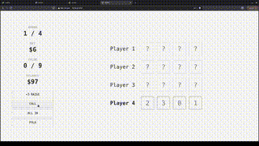

# Zero

A real-time multiplayer card game played in the browser. Built with a Java Spring Boot backend communicating over WebSockets, so every move is instantly synced across all connected players.




## Tech stack

- Java, Spring Boot, Maven
- WebSockets
- HTML, CSS, JavaScript


## Testing locally

**Prerequisites:** Java and Maven installed.

**1. Clone the repo**
```bash
git clone https://github.com/nicholaiw/zero.git
cd zero
```

**2. Start the server**
```bash
cd Server
./mvnw spring-boot:run
```

**3. Serve the client**
```bash
cd Client
python3 -m http.server 3000
```

Then open `http://localhost:3000` in your browser.


## Test multiplayer locally

1. Complete the steps above
2. Open `http://localhost:3000` in **four separate browser tabs**
3. Press "JOIN GAME" in each tab to enter the same room